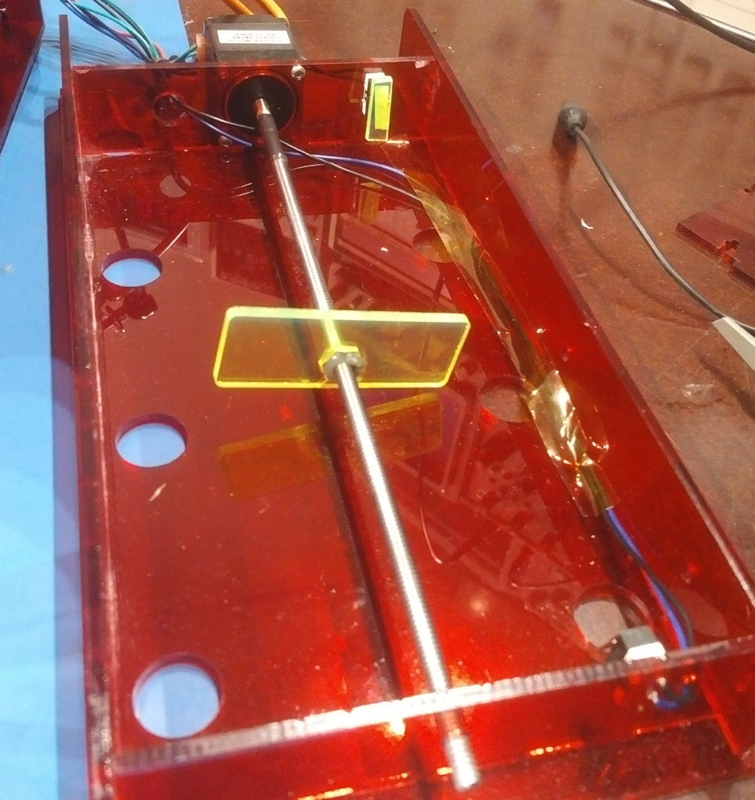
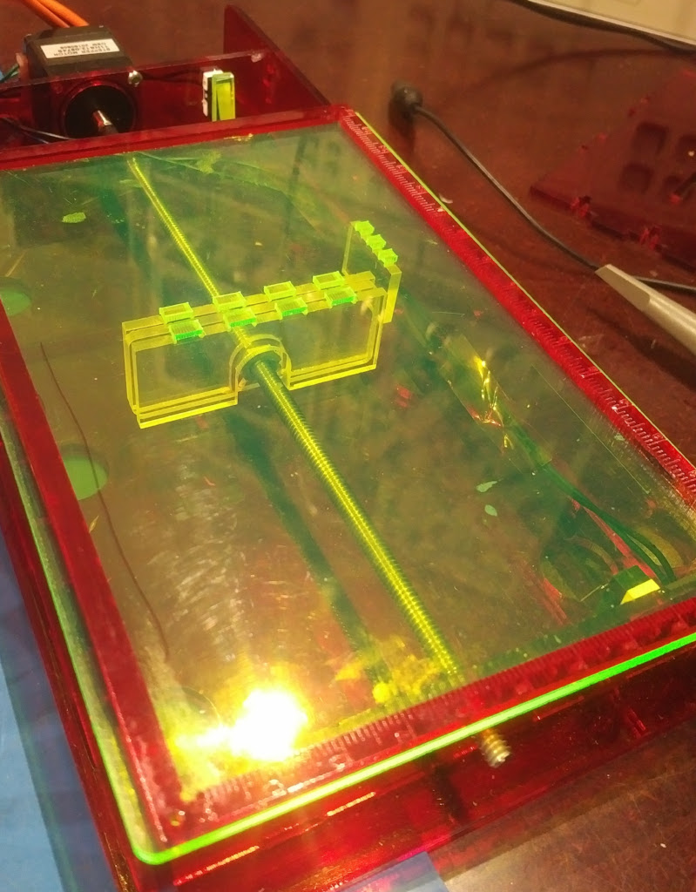
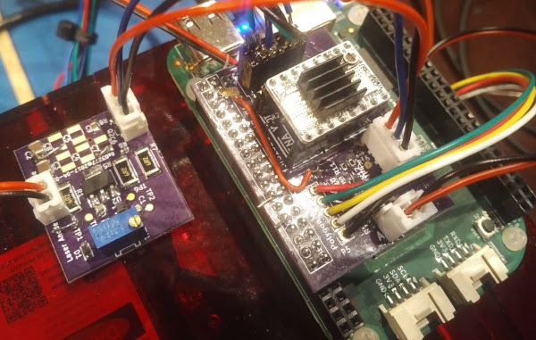

LDGraphy design overview
========================

### Theory

At its core, LDGraphy is a switched laser, a rotating mirror that
moves the dot in a scan-line and a sled that moves the photoresist-coated PCB
forward.

Laser scanning is very simple and cheap to do with common components these
days. Lasers with a wavelength of 405nm (which is close to the peak-sensitivy
of dry-film photoresist) can be found cheaply with around 500mW power.

As for scanning, there are several techniques. A common one is to have a mirror
that rotates to deflect a laser. Since it would take a while for a mirror
to turn around full 360 degrees after a segment is scanned, they come as
a polygon mirror: a polygon that has mirror-reflective edges.
A typical mirror that is used in Laser printers 6 sides; you notice that
the actual mirror face is not that high - but we only need to deflect a laser dot.

|    Top                      | Side
|-----------------------------|-------------------------------
|   | 

Now, with this arrangement, we could project a full 120 degree arc (each mirror
face represents 60 degrees, so the angle between incident ray and reflected ray
reaches 120 degrees).

Here, we just shine (a fast blinking) laser at an angle from the top, it is
reflected at the rotating mirror and projected downwards.

We can make a scanning device with this if we correct for the arc in software;
in fact, in an early experiment for LDGraphy I was doing exactly that:

[![Early experiment][early-experiment]][arc-project-vid]

There are advantages for this set-up: we use a large angle range, so
essentially can utilize the full laser on-time. Also, the laser is always
in focus where it hits the board because it always is the same distance from
the lens. The disadvantages is that the laser dot hits the
photo resist at a shallow angle. This of course increases the size of the
exposure point seen by the photoresist.

This could be fixed, if we had a mirror that points the laser-arc downwards, so
that it hits the resist perpendicularly. The mirror would need to be a circular
segment with a downwards angle -- essentially the slice of a cone.

[ todo: make an illustration ]

However, making custom mirrors in such a shape at home is not really feasible
(Someone who has access to a lathe: this would essentially be a 45 degree bevel
on the inside of a large diameter stainless steel pipe with a wall thickness
of about 2-3mm. Then mirror finish polishing this bevel. I don't have
access to a lathe though :/).

We want to build this machine at home or with minimal accessible tools, so this
is a hurdle.

So we can simplify and use a straight mirror to project downwards and get a line.
however, the focus point then is of course not always in the plane of the
photo sensitive material. In particular if we cover a full 120 degrees, the
focus variants are significant.

[ todo: make an illustration ]

In professional scanning applications, they use a trick to get this in focus:
a so-called f-theta lens is a specially ground lens that makes sure that the
laser dot always focuses in a plane. This is also somewhat out of reach
for the hobbyist (though I still want to try making one with transparent
acrylic). If you take apart a laser printer, you will see a weirdly shaped
lens set in the laser assembly: that is an f-theta lens.

What else we can do ?

If we choose to do the straight projection, but limit ourselves to a smaller
angle, the focus variation is not _that_ much and we get an acceptable
compromise.

[ todo: make an illustration ]

We don't need any special mirror or lens. The disadvantage is, that we only
can use part of the time of the laser: if we use 40 degree scanning out
of 120 degree, we only use the laser for 1/3 of the time.

So let's review our options

   * Build a scanner by pointing the laser at a shallow angle at the polygon
     mirror:
       * :thumbsup: very simple; full use of the laser; No light losses.
       * :thumbsdown: hitting photo resist at a shallow angle; Large build.

   * Build a scanner with a 45 degree cone mirror:
       * :thumbsup: full use of laser; no light losses; hitting resist
       	  perpendicularly.
       * :thumbsdown: Hard to build.

   * Build an f-theta lens and use a straight scanning projection:
       * :thumbsup: Full use of the laser; hitting resist perpendicularly.
       * :thumbsdown: hard to build. Might have optical losses in the material.

   * Only use part of the scanning range and use a straight mirror:
       * :thumbsup: easy to build.
       * :thumbsdown: we need longer exposure time because we only have a limited
       	  on-time.

Since ease-of-build for everyone with limited access to tools is a priority,
we use the last variant for this first version of LDGraphy.

### Practice

#### Scanning

This is how the current LDGraphy device looks like. From the top, we can
see all relevant components for the laser scanning:

|   Drawing                      | Reality
|--------------------------------|---------------------------------
|[See full drawing here][hardware] | 

To keep things more compact, the laser is mounted in one corner and the light
is redirected onto the polygon mirror. But other than that, this is exactly
as discussed above. There is a long mirror on the side that is pointing
downwards, a little hard to see from above, so lets look from the back, with
some rough indication of the laser path:

When the polygon mirror is rotating, the laser point passes through a slit onto
the surface to be exposed.

On the left, you see a fluorescing piece of material that has a photo diode
attached. This is our horizontal sync (HSync) to detect when a laser line starts.

##### Issues

There is an issue that I discovered with some cheap polygon mirrors: the six
mirror faces have a little variation and not being entirely parallel to the
rotating axis, so project lines up and down a little, depending on the face.
So what needs to be done is to have another sensor to count mirror faces, and
then correct for this after a calibration step in software.

#### Moving the sled

The sled is moved with a stepper motor and a threaded rod. This rod does not
need to be CNC quality ball-screw, a simple screw from the hardware store is
sufficient. Why ? We only need to move in one direction, so we don't care about
backlash issues.

Here is how the base looks like, housing the motor and the threaded rod. The rod
is 'mounted' to the shaft of the motor with a heatshrink tubing (and a little
expoxy butting these together). A nut is not directly mounted to the sled but
to a slab of acrylic. You also see both the limit-switches:

|   Just drive                   | .. with sled
|--------------------------------|---------------------------------
| | 

This allows us to have a separate sled that then sits on top of the moving
slab of acrylic. The design detail here is, that it allows to drive the sled
forward and backward, but has freedom to move in other directions: this can
be used to essentially be immune to 'wobble' from the cheap threaded rod.
In the current test version of LDGraphy, I have a horribly wobbling rod that
I found in a corner of my workshop.

You [see the wobble in the video :movie_camera:][ldgraphy-vid]; It still produces
acceptable quality

[![Resolution test][resolution-thumb]][resolution]

#### Electronics

Everything is controlled by a BeagleBone Black or Green. It has the nice property
that it is a common ARM machine running Linux (so offers the comfortable
environment of a full operating system including networking and can do all the
work like converting Gerbers and do image processing), but it also has
a built-in Programmable Realtime Unit (PRU) - a fast (200Mhz), independent
microcontroller essentially to help do the timing-accurate parts interfacing
the hardware.

We need this to accurately
generate the pulses to control the polygon mirror, switch on the Laser at the
right times (we have about 2Mhz pixel clock), and generally keep track of where
the laser is. And before you ask: of course, this could be done with an external
Cortex M4 or so, connected via SPI to some other computer (it would be more
expensive of course, but it works). I just had the BeagleBone lying around and
had used the PRU in a [previous project][beagleg].

The laser requires a current source, in our case it needs to be switched in the
low Mhz range. Some lasers (that you get from e.g. Aliexepress) already have a
"TTL driver", but they are utterly low frequency (50ish kHz), so this is why this
project needed its own [laser current driver] (not perfect yet, but works).

Right now, all the electronics is attached to the outside of the case, for easy
hacking and scope-probe access. Eventually, all these parts will
go inside the case.

[resolution-thumb]: ./img/line-resolution-small.jpg
[resolution]: https://plus.google.com/u/0/+HennerZeller/posts/a8taHWeL5CC
[beagleg]: https://github.com/hzeller/beagleg
[Laser current driver]: ./pcb/laser-drive
[early-experiment]: ./img/arc-projection-vid.jpg
[arc-project-vid]: https://youtu.be/8tyT4CI-1io
[ldgraphy-vid]: https://youtu.be/G9-JK2Nc7w0
[hardware]: ./hardware#cut-pattern